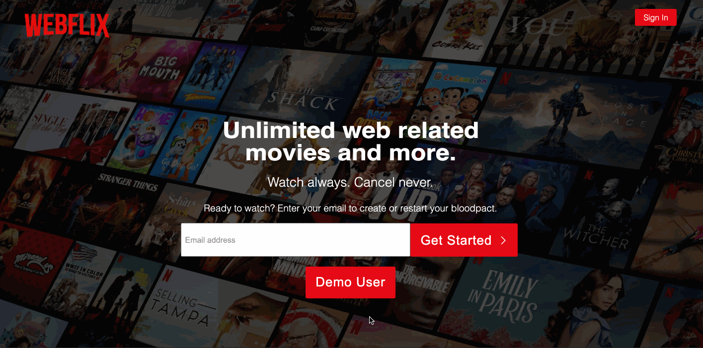
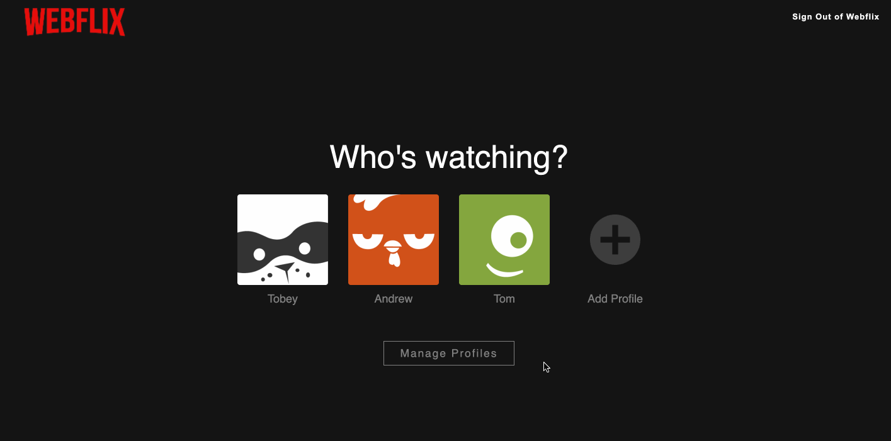
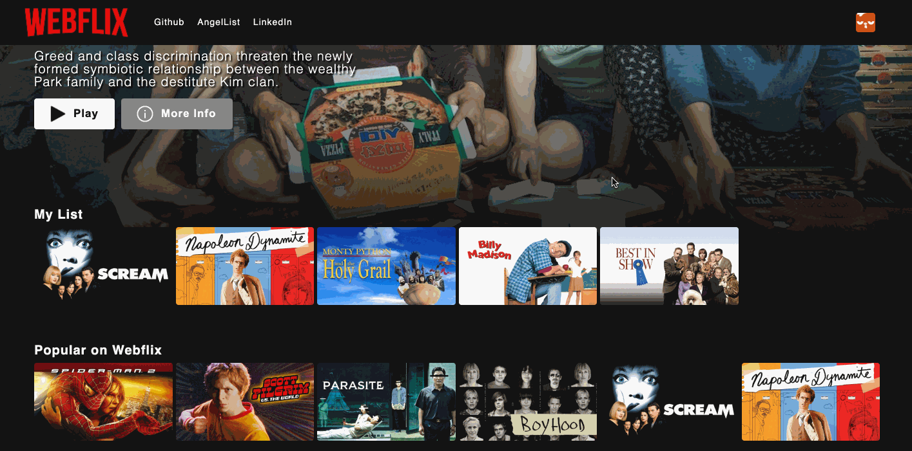
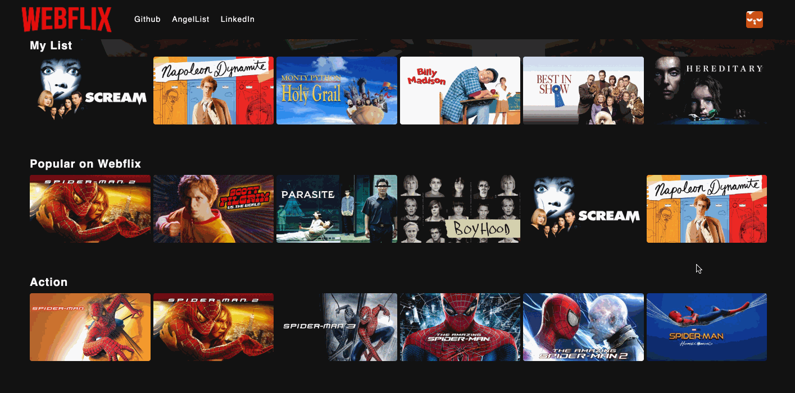

# WELCOME TO WEBFLIX

Check out the [Live Site](https://webflix-clone.herokuapp.com/#/)!

### Introduction

Webflix is a clone of the Netflix website at the time of creation. Netflix is a subscription streaming service that offers users a media library of films and television series. A Netflix user can create unique profiles after signing up and view, like, and add (to a My List category) specific titles from Netflix's library. It also curates titles based on genre and popularity. As a huge movie fan, I was interested in building out a film media platform like Netflix's that anyone can use and offers a user-friendly design. The technologies implemented in this project include:

* Languages: Javascript, Ruby, HTML, and CSS
* Frontend: React-Redux
* Database: PostgreSQL
* Hosting: Heroku
* Asset Storage: AWS Simple Cloud Storage (S3)

# MVPs

## Profiles

A Webflix user is able to create new profiles, which persist to both the front and backend, and select existing or newly created profiles in order to begin browsing:



```
  render() {
    if (!this.state.add) {
      return (
        <ul className="profiles-index-list">
          {this.props.profiles.map(profile => {
            return (
              <li className="profile-index-list-item" key={profile.id}>
                <ProfilesIndexItem profile={profile} fetchMylistedVideos={this.props.fetchMylistedVideos} fetchLikes={this.props.fetchLikes} />
              </li>
            )
          })}
          <li> 
            <div className="profile-index-add-profile" onClick={this.addProfile}>
              
              <p>Add Profile</p>
            </div>
          </li>
        </ul>
      )
    } else if (this.state.add) {
      return (
        <div className="add-profile-modal">
          <div className="add-profile-modal-container">
            <div className="add-profile-headings-container">
              <h2>Add Profile</h2>
              <h3>Add a profile for another person watching Netflix.</h3>
            </div>
            <div className="add-profiles-main-container">
                
                <input type="text" placeholder="Name" value={this.state.name} onChange={this.updateName} />
            </div>
            <div className="add-profiles-button-container">
              <button className="profile-continue" onClick={this.continueAdd}>Continue</button>
              <button className="profile-cancel" onClick={this.cancelAdd}>Cancel</button>
            </div>
            {this.props.errors ? <h3 className="errors">{this.props.errors[0]}</h3> : <div></div>}
          </div>
        </div>
      )
    }
  }
```

A webflix user can also manage their profiles, allowing them to change a profile's name and avatar and delete existing profiles:



```
    if (this.props.modal === 'editProfile') {
      return (
        <div className="edit-profile-modal">
          <div className="edit-profile-modal-container">
            <div className="edit-profile-heading-container">
              <h2>
                Edit Profile
              </h2>
            </div>
            <div className="edit-profile-main-container">
              <div className="pencil-circle">
              </div>
               {this.props.receiveIconModal()} } className="pencil" img src={window.editPencilImage} alt="pencil button" />
              
              <input type="text" value={this.state.name} placeholder={this.state.selectedName} onChange={this.updateName}/>
            </div>
            <div className="edit-profile-button-container">
              <button className="edit-profile-save" onClick={this.saveProfile}>Save</button>
              <button className="edit-profile-cancel" onClick={this.cancelEdit} >Cancel</button>
              <button className="edit-profile-cancel" onClick={this.deleteProfile} >Delete Profile</button>
            </div>
            {this.props.errors ? <h3 style={{ fontSize: "14px", color: "#e87c03" }}>{this.props.errors[0]}</h3> : <div></div>}
          </div>
        </div>
      )
    } 
```

## Browse/Watch

Upon logging in with one of their profiles, a Webflix user is greeted by Webflix's featured film, which is randomly generated every time the user signs in to Webflix:


```
render() {      
      return (
        <div className="featured-title-inner-container">
          <div className="featured-title-info-buttons">
            <h2>{this.props.featuredTitle.title}</h2>
            <h3>{this.props.featuredTitle.description}</h3>
            <div className="featured-title-buttons">
              <button className="featured-title-play-button" onClick={this.openPlayModal}>Play</button>
              <button className="featured-title-info-button" onClick={this.openShowModal}>More Info</button>
            </div>
          </div>
          <div className="featured-background-gradient"></div>
          
        </div>
      )
    }
```

Otherwise, a Webflix user also has access to Webflix's entire library of curated films. By hovering over film thumbnails, the user can play a title, add it to their My List category, or like a film:


```
render() {
  return (
        <div className="genre-index-item-modal">
          <div className="genre-index-item-modal-buttons">
            <div className="main-buttons">
              <button className="title-play-button" onClick={this.openPlayModal} >
                
              </button>
                {this.props.mylistedVideos.some(id => id === this.props.video.id) ? <button className="mylist-button" onClick={this.deleteVideoFromMylist} >
                  
                </button> : <button className="mylist-button" onClick={this.addVideoToMylist} >
                  
                </button>}
                {/* like button */}
                {this.props.likedVideos.some(id => id === this.props.video.id) ? <button className="like-button" onClick={this.unlikeVideo} >
                  
                </button> : <button className="like-button" onClick={this.likeVideo} >
                  
                </button>}
            </div>
            <div className="show-button-div">
              <button className="show-button" onClick={this.openShowModal} >
                
              </button>
            </div>
          </div>
          <div className="genre-index-item-modal-info">
            <h3>{this.props.video.year}  {this.props.video.runtime} minutes</h3>
          </div>
          <div className="genre-index-item-modal-genre">
            <h3>{this.props.video.genre.genre}</h3>
          </div>
        </div>
  )
}
```

They can also open that title's show modal, which provides more information about the film along with the previously available functionality.


## My List

If a Webflix user desires, they can add specific titles to their My List, a top level category that will only display if a user has added titles to their My List. Users can also discard titles from their My List whenever they please. If a user adds more than 6 titles to their My List, the row will be given "scroll" functionality with left and right arrow buttons that will lose functionality once the user has reached the end of the row:



```
  render() {
    let style = {
      position: "relative",
      left: `${this.state.xOffset}px`,
    }
    return (      
      <div className="genres-index">
        {this.props.mylistVideos.length === 0 ? <div></div> : <div className="genre">
          <h2>My List</h2>
          <div className="my-list-header-and-buttons">
            {/* { this.props.mylistVideos.length < 7 ? <div></div> : <button className="left-scroll-button" onClick={this.scrollLeft}></button>}
            { this.props.mylistVideos.length < 7 ? <div></div> : <button className="right-scroll-button" onClick={this.scrollRight}></button>} */}
            <button className="left-scroll-button" onClick={this.scrollLeft}></button>
            <button className="right-scroll-button" onClick={this.scrollRight}></button>
          </div>
          <div className="row-overflow">
            <ul style={style} id="mylist-row">
              {this.props.mylistVideos.map((video, idx) => {
                return (
                  <li key={idx} >
                    <GenresIndexItemContainer video={video} modal={this.props.modal} receiveShowModal={this.props.receiveShowModal} discardShowModal={this.props.discardShowModal} play={this.props.play} receiveWatch={this.props.receiveWatch} discardWatch={this.props.discardWatch} />
                  </li>
                )
              })}
            </ul>
          </div>
        </div>}
      </div>
    )
  }
```


## Likes

In addition to adding titles to their My List, Webflix users can also like film titles in the library. This won't add titles to a Likes category, but instead will change that film's standing in Webflix's library. Deending on their number of likes across all profiles and users, only the "most popular" Webflix titles will be added to Webflix's "Popular on Webflix" category, another dynamic, top-level row:



```
export const filterPopularVideos = state => {
  let popularVideos = [];
  let likes = Object.values(state.entities.likes);
  let likedVideosHash = {};
  likes.forEach(like => {
    let videoId = like["video_id"];
    if (!likedVideosHash[videoId]) likedVideosHash[videoId] = 0;
    likedVideosHash[videoId] += 1;
  })
  
  let sortedArray = [];
  for (let key in likedVideosHash) {
    sortedArray.push([key, likedVideosHash[key]]);
  }

  sortedArray.sort(function(first, next) {
    return first[1] - next[1];
  });

  for (let i = sortedArray.length-1; i >= 0; i--) {
    let id = sortedArray[i][0];
    popularVideos.push(state.entities.videos[id]);
  }
  
  if (popularVideos.length > 6) {
    return popularVideos.slice(7);
  } else if (popularVideos.length > 0 && popularVideos.length < 7) {
    return popularVideos;
  }
}
```

```
    render() {
      return (  
        {this.props.popularVideos ? this.props.popularVideos.length === 0 ? <div></div> : <div className="genre">
          <h2 className="popular-heading">Popular on Webflix</h2>
          <ul>
            {this.props.popularVideos.map((video, idx) => {
              return (
                <li key={idx} >
                  <GenresIndexItemContainer video={video} modal={this.props.modal} receiveShowModal={this.props.receiveShowModal} discardShowModal={this.props.discardShowModal} play={this.props.play} receiveWatch={this.props.receiveWatch} discardWatch={this.props.discardWatch} />
                </li>
              )
            })}
          </ul>
        </div> : <div></div>}
      )
    }
```

### Thanks

Webflix was created within a 14 day time frame. Thank you for your time and consideration! I hope you enjoy it!